<div align="center">



<br/>

[](#-quick-start)
[](#-features)
[](#-quick-start)
[](#-roadmap)

<br/>


-9b59b6?style=flat-square&logo=opensourcehardware&logoColor=white)

<h3>Catch hidden third-party SDK trackers in your Android app — before your users (or a regulator) do.</h3>

<p>
<b>SDK-Sanitizer</b> scans an Android app — either a built <code>.apk</code> or its <b>source tree</b> — for known
third-party tracker SDKs by their <b>code signatures</b> (package/class names) and <b>network signatures</b> (endpoints).
Every match is mapped to a <b>GDPR / CCPA</b> compliance note and a triage <b>severity</b>, then exported as
<b>SARIF</b> (GitHub code scanning), <b>JSON</b> (automation) or <b>Markdown</b> (humans). Ships as both a <b>CLI</b>
and a <b>GitHub Action</b> with a <code>--fail-on</code> CI gate. The core runs on the Python standard library only —
no app upload, no cloud, fully local.
</p>

</div>

---

## 📑 Table of Contents

- [✨ Features](#-features)
- [🔍 Detection / Rules](#-detection--rules)
- [🏗 Architecture](#-architecture)
- [⚡ Quick Start](#-quick-start)
- [⚖️ Legal & Attribution](#️-legal--attribution)
- [🗺 Roadmap](#-roadmap)
- [💚 Support / Crypto Donations](#-support--crypto-donations)
- [📄 License](#-license)

---

## ✨ Features

<table>
<tr>
<td width="33%" valign="top">

### 🔍 Dual signatures
Detects trackers by **code signatures** (package/class names found in source or DEX) **and** **network signatures** (endpoints in source). Regex-based, with safe fallback to literal matching on bad patterns.

</td>
<td width="33%" valign="top">

### ⚖️ Compliance-aware
Each tracker category maps to a **GDPR / CCPA** note and a **severity** (`low → critical`). Advertising, identification, location and profiling escalate; analytics, crash-reporting and notifications are graded down.

</td>
<td width="33%" valign="top">

### 🧾 Three report formats
**SARIF** for GitHub code scanning (rules + leveled results), **JSON** for automation pipelines, and **Markdown** for human review — all from the same scan, picked with `-f`.

</td>
</tr>
<tr>
<td width="33%" valign="top">

### 🛠 CLI + GitHub Action
One `sdk-sanitizer` command, or drop the composite **GitHub Action** into a workflow. The Action installs `androguard`, runs the scan and uploads SARIF to code scanning automatically.

</td>
<td width="33%" valign="top">

### 📦 Source *and* APK
Scan a **source directory** with zero heavy dependencies (stdlib only), or a built **`.apk`** via the optional `androguard` extra — same matcher, same reports.

</td>
<td width="33%" valign="top">

### 🚦 `--fail-on` CI gate
Break the build when the **maximum severity** meets or exceeds a threshold (`low` / `medium` / `high` / `critical`). Exit code `2` signals a gate failure for CI.

</td>
</tr>
</table>

> 🔄 Bonus: `--update` refreshes the local signature database straight from the **Exodus Privacy** API (optional `requests` extra).

---

## 🔍 Detection / Rules

The scanner builds two corpora from your app and matches them against the bundled signature database:

1. **Extract** — from source files (`.java/.kt/.kts/.xml/.gradle/.smali/.json/.properties/.txt/.pro`) it harvests dotted **package/class tokens** and `http(s)://` **domains**; from an APK it pulls fully-qualified **class names** out of every DEX via `androguard`.
2. **Match** — each tracker's `code_signature` is searched against the token corpus and its `network_signature` against the domain corpus (compiled as regex; invalid patterns fall back to literal). A hit records whether it matched on `code`, `network`, or both.
3. **Assess** — every category on a matched tracker is resolved to a severity; the tracker takes the **highest** of its categories and accumulates the relevant GDPR/CCPA notes.

### Category → severity map

| Category        | Severity   | Why it matters (GDPR / CCPA)                                                              |
|-----------------|------------|------------------------------------------------------------------------------------------|
| Advertisement   | `high`     | Ad/targeting needs explicit consent (GDPR Art. 6(1)(a) + ePrivacy); CCPA opt-out of sale.|
| Identification   | `high`     | Device/user identification — high sensitivity, explicit consent required.                |
| Location        | `high`     | Geolocation is a special risk; requires explicit consent and data minimisation.          |
| Profiling       | `high`     | Profiling (GDPR Art. 22) — transparency and right to object.                             |
| Analytics       | `medium`   | Processes personal data; needs a legal basis and privacy-policy disclosure (Art. 13).    |
| Crash reporting | `low`      | Crash dumps may carry PII (stack traces, identifiers) — disclose in policy.              |
| Notifications   | `low`      | Lower-risk category; graded down unless paired with a higher one.                        |
| *(unmapped)*    | `medium`   | Any unknown category defaults to `medium` so nothing slips through silently.             |

The bundled snapshot ships with well-known SDKs out of the box — Google AdMob, Firebase Analytics / Crashlytics, Google Analytics, Facebook, Flurry, Yandex AppMetrica, AppsFlyer, Amplitude, Adjust, OneSignal and Mixpanel — and the full Exodus catalogue is one `--update` away.

---

## 🏗 Architecture

A pure, testable core (stdlib only); `androguard` and `requests` are lazy, optional extras.

```
                ┌──────────────┐
   target ────▶ │   loader     │  trackers.py — load snapshot DB / fetch from Exodus API
   (.apk |      └──────┬───────┘
    source)            │ signatures
                       ▼
                ┌──────────────┐   source dir → stdlib walk (tokens + domains)
                │  extractor   │   .apk        → androguard DEX class names
                └──────┬───────┘   extractor.py
                       │ tokens, domains
                       ▼
                ┌──────────────┐
                │   matcher    │  matcher.py — regex code/network signatures
                └──────┬───────┘
                       │ matched trackers
                       ▼
                ┌──────────────┐
                │  compliance  │  compliance.py — category → GDPR/CCPA + severity
                └──────┬───────┘
                       │ assessed findings
                       ▼
                ┌──────────────┐
                │  reporters   │  reporters.py — SARIF / JSON / Markdown
                └──────┬───────┘
                       │
                       ▼
                ┌──────────────┐
                │   CI gate    │  cli.py — --fail-on → exit code 2 on threshold
                └──────────────┘
```

```
sdk_sanitizer/
  trackers.py    # load snapshot DB / fetch from Exodus API / save snapshot
  extractor.py   # source scan (stdlib) | APK scan (androguard, optional)
  matcher.py     # regex match classes/domains vs signatures
  compliance.py  # category → GDPR/CCPA notes + severity
  reporters.py   # SARIF / JSON / Markdown
  cli.py         # argparse, CI exit codes
data/trackers_snapshot.json   # bundled known-tracker signatures (Exodus-derived, ODbL)
action.yml                    # GitHub Action (composite)
tests/                        # unit tests (no APK / no network)
```

---

## ⚡ Quick Start

### Install

```bash
git clone https://github.com/DuminAndrew/SDK-Sanitizer
cd SDK-Sanitizer
pip install -e .              # the `sdk-sanitizer` command (core needs no extra deps)
pip install -e ".[apk]"       # + APK support (androguard)
pip install -e ".[update]"    # + live DB update (requests)
```

> Or run straight from source, no install: `python -m sdk_sanitizer.cli <target>`

### CLI

```bash
sdk-sanitizer ./app/src                                 # scan a source dir → Markdown report
sdk-sanitizer app-release.apk -f json -o report.json    # scan an APK → JSON
sdk-sanitizer . -f sarif -o sdk.sarif --fail-on high     # CI: SARIF + fail if a high+ tracker is found
sdk-sanitizer --update                                   # refresh the tracker DB from Exodus
```

| Flag             | Values                                   | Purpose                                            |
|------------------|------------------------------------------|----------------------------------------------------|
| `-f`, `--format` | `md` · `json` · `sarif`                  | Report format (default `md`).                      |
| `-o`, `--output` | path                                     | Write report to a file (default: stdout).          |
| `--fail-on`      | `low` · `medium` · `high` · `critical`   | Exit `2` when max severity ≥ level (CI gate).      |
| `--db`           | path                                     | Use a custom tracker JSON instead of the snapshot. |
| `--update`       | —                                        | Refresh the local DB from the Exodus API and exit. |

### GitHub Action

```yaml
- uses: DuminAndrew/SDK-Sanitizer@v1
  with:
    target: 'app/src/main'   # path to .apk or source dir (default: '.')
    format: 'sarif'          # md | json | sarif (default: sarif)
    output: 'sdk-sanitizer.sarif'
    fail-on: 'high'          # optional: fail the job at this severity or higher
```

When `format: sarif`, the Action uploads results to **GitHub code scanning** automatically.

---

## ⚖️ Legal & Attribution

- **Tracker signature data** (names, code/network signatures, categories) is **derived from the [Exodus Privacy](https://exodus-privacy.eu.org/) project**, published under the **Open Database License (ODbL v1.0)** with contents under the **Database Contents License (DbCL v1.0)**. Attribution is provided here and in [`NOTICE`](NOTICE); any redistributed derivative database is shared alike.
- **No Exodus source code is used.** Exodus' application code is licensed AGPL-3.0 and is **not** included or derived from — SDK-Sanitizer only references the openly-licensed signature **data**.
- **Not legal advice.** This tool performs heuristic static analysis. Results may include false positives (obfuscation, R8/ProGuard re-classing) or miss obfuscated trackers. Verify findings and consult a qualified professional before acting on compliance conclusions.

> Exodus tracker API: `https://reports.exodus-privacy.eu.org/api/trackers` · ODbL: `https://opendatacommons.org/licenses/odbl/1-0/`

---

## 🗺 Roadmap

- [ ] **Kotlin / dexlib2 Gradle plugin** — run the scan as a Gradle task during the build.
- [ ] **Manifest permission analysis** — correlate declared permissions with detected trackers.
- [ ] **R8 / ProGuard-aware matching** — resolve re-classed/obfuscated package names to reduce misses.
- [ ] **Domain extraction from APK resources** — recover network signatures from compiled APKs, not just source.
- [ ] **Baseline / suppression file** — accept known findings to keep CI green on reviewed trackers.

---

## 💚 Support / Crypto Donations

If SDK-Sanitizer saved you an audit, a coffee is always appreciated. Donations are voluntary.

> ⚠️ Replace the placeholders below with your **real, verified addresses + QR images** before publishing.

| Coin | Network          | Address (placeholder)                          | QR |
|------|------------------|------------------------------------------------|----|
| **BTC**  | Bitcoin          | `bc1qXXXXXXXXXXXXXXXXXXXXXXXXXXXXXXXXXXXXXX`    |  |
| **ETH**  | Ethereum / EVM   | `0xXXXXXXXXXXXXXXXXXXXXXXXXXXXXXXXXXXXXXXXX`    |  |
| **USDT** | TRON (TRC20)     | `TXXXXXXXXXXXXXXXXXXXXXXXXXXXXXXXXXX`           |  |

### 🔐 Donation safety

- Verify the address **only** from the official release page — never from forks, issues, or screenshots.
- **Match the network** (TRC20 ≠ ERC20). Sending to the wrong network usually means lost funds.
- Donations are voluntary and **do not** grant a support SLA or constitute investment of any kind.
- Maintainers will **never** DM you asking for donations.

---

## 📄 License

**MIT** © [Andrew Dumin](https://github.com/DuminAndrew) — see [`LICENSE`](LICENSE).
Tracker signature data © Exodus Privacy contributors (ODbL/DbCL) — see [`NOTICE`](NOTICE).

<div align="center">
<br/>

[](https://github.com/DuminAndrew/SDK-Sanitizer/stargazers)

<sub>Built by <a href="https://github.com/DuminAndrew">DuminAndrew</a> · Scan locally. Ship privately.</sub>

</div>
